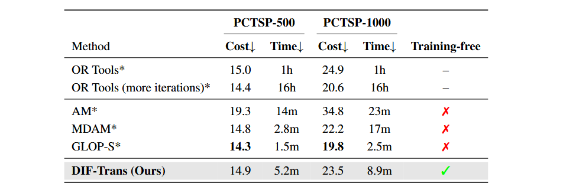
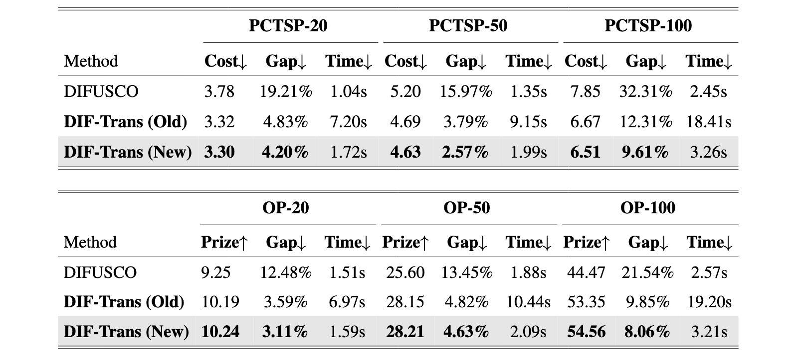

# Anonymous-1441

 

Table 1: Comparison of various methods on 128 instances of PCTSP-500 and PCTSP-1000. The data generation and evaluations are conducted following Ye et al. (2024). Results marked with * are taken directly from Ye et al. (2024).

 

Table 1: Comparison of various methods on 128 instances of PCTSP-500 and PCTSP-1000. The data generation and evaluations are conducted following Ye et al. (2024). Results marked with * are taken directly from Ye et al. (2024).

