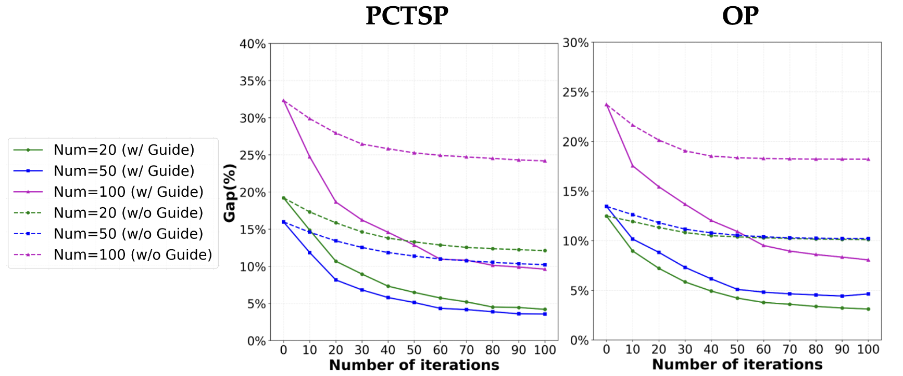
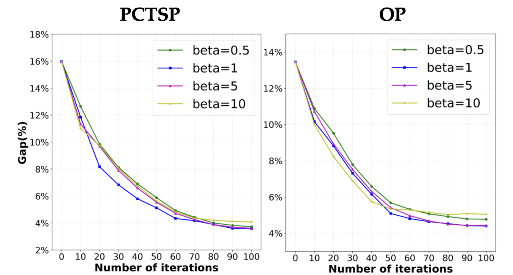

 

Table 1: Performance analysis with and without energy guidance on PCTSP and OP problems across multiple problem scales. The ablation studies demonstrate that energy guidance is essential for maintaining effective cross-problem generalization capabilities.

 

Table 2: Experimental results showing the impact of varying $\beta$ on PCTSP-50 and OP-50 instances, with temperature fixed at 0.1. The performance remains relatively robust across different $\beta$ values, indicating that the method is not highly sensitive to this hyperparameter. 

