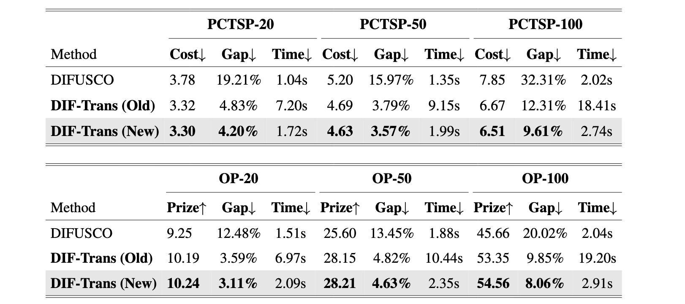
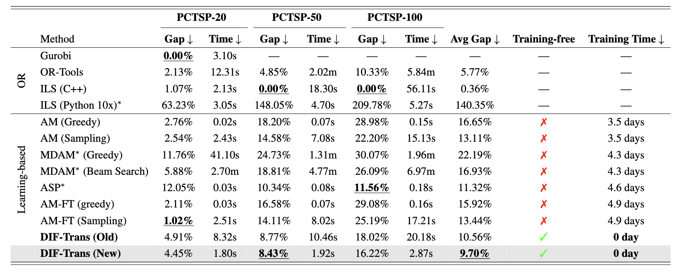
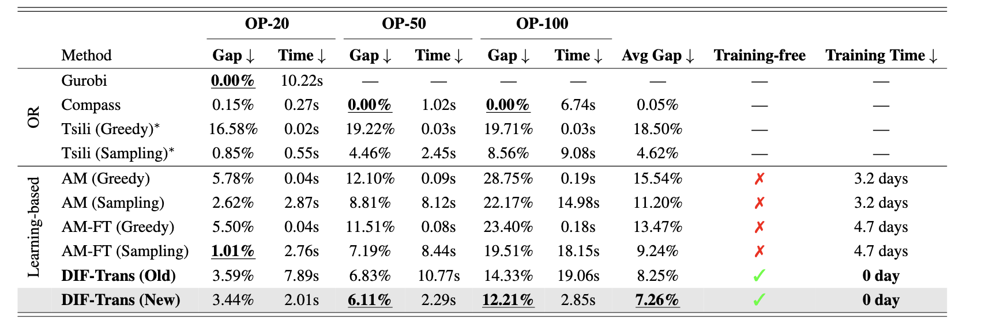

 

Table 1: Updated results of Zero-shot cross-problem transfer performance comparison between TSP-trained DIFUSCO and our DIF-Trans approach on PCTSP and OP instances. 

 

Table 2: Updated results of cross-scale generalization capabilities across different solver categories on PCTSP instances.

 

Table 3: Updated results of cross-scale generalization capabilities across different solver categories on OP instances.

